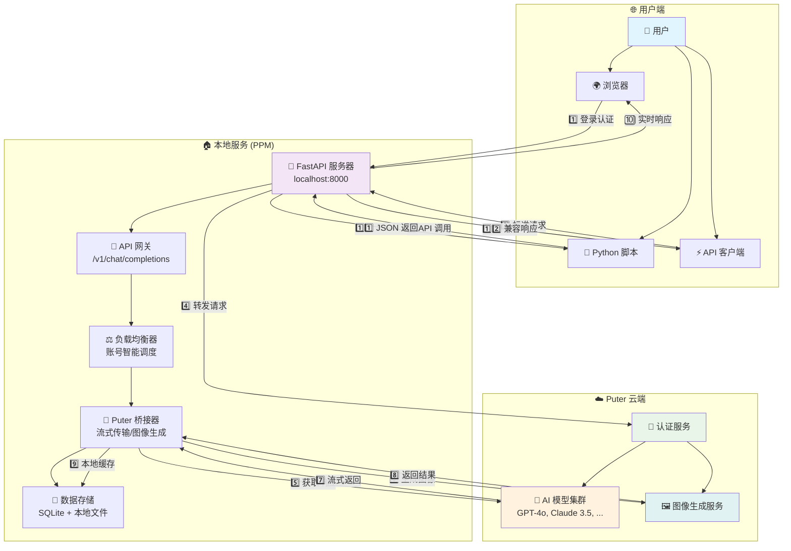
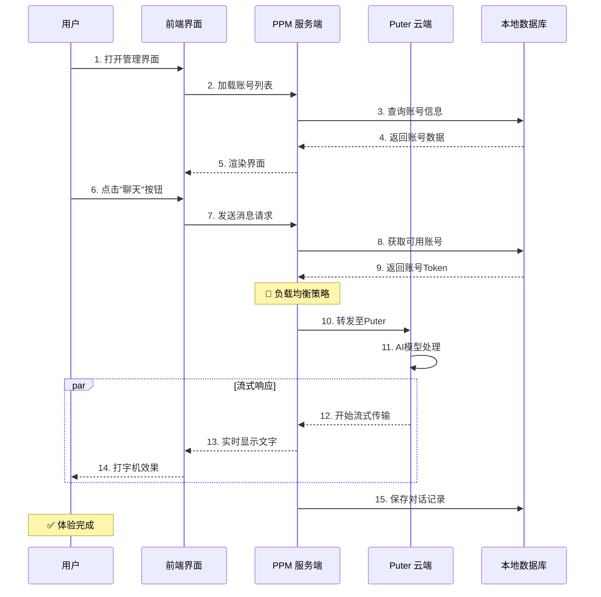
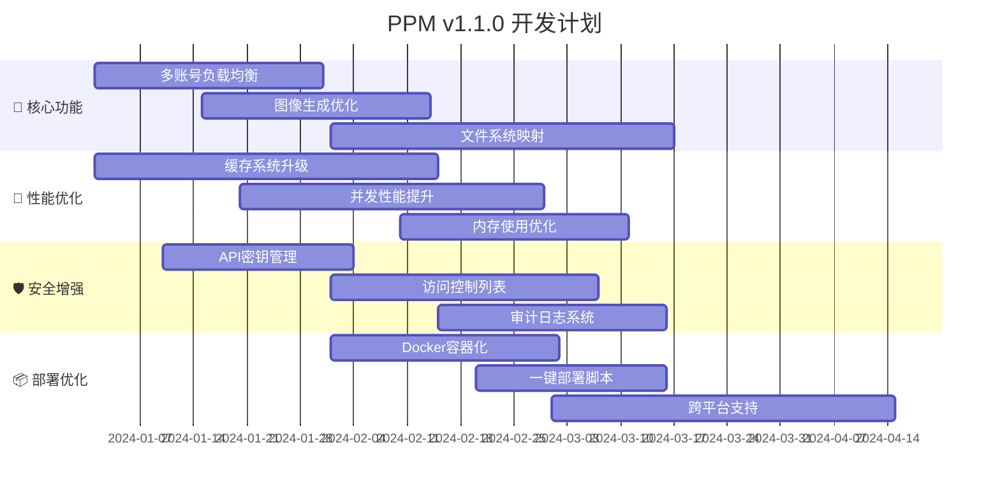

# 🚀 Puter Python Manager (PPM) - 本地 AI 算力桥梁

[](https://opensource.org/licenses/Apache-2.0)
[](https://www.python.org/)
[](https://puter.com/)
[](https://github.com/lza6/puter-python)

> **"让每个人都能平等、自由、便捷地触达 AI 的力量。"** 🌌

欢迎来到 **Puter Python Manager (PPM)**！这是一个创新的开源项目，旨在打通 Web 端与本地 Python 环境的壁垒。通过集成强大的 [Puter.js](https://docs.puter.com/)，我们将云端的 GPT-4、Claude 3.5 等顶级 AI 模型能力，"桥接"到您的本地 Python 环境中，并提供优雅的可视化管理界面。

🔗 **GitHub 仓库**: [https://github.com/lza6/puter-python](https://github.com/lza6/puter-python)

---

## 📖 目录

1.  [🌟 项目简介](#-项目简介)
2.  [🏗️ 系统架构图](#-系统架构图)
3.  [📂 项目结构树](#-项目结构树)
4.  [⚡ 快速开始](#-快速开始)
5.  [🛠️ 技术原理与深度解析](#-技术原理与深度解析)
6.  [🎨 UI/UX 设计](#-uiux-设计)
7.  [✅ 优缺点与适用场景](#-优缺点与适用场景)
8.  [🗺️ 开发路线图](#-开发路线图)
9.  [🤝 开源理念](#-开源理念)
10. [📜 许可证](#-许可证)

---

## 🌟 项目简介

### 核心功能
**Puter Python Manager** 是一个智能中间件系统：
*   在您的本地运行一个 Web 服务器（基于 FastAPI）
*   提供美观的 Web 界面，用于管理 Puter 账号（支持多种 AI 模型）
*   将 AI 能力转换为标准的 OpenAI 格式 API 接口
*   **最终效果**：您可以在本地使用 Python 代码或任何兼容 OpenAI API 的工具，免费调用 GPT-4o、Claude 3.5 Sonnet 等高级模型！

### 核心价值
1.  **💸 零成本访问**：利用 Puter 提供的免费额度，无需支付昂贵的 API 费用
2.  **🔒 本地化管理**：所有账号数据、Cookie、日志均存储在本地 `data/` 目录，确保隐私安全
3.  **⚙️ 开发者友好**：为 Python 开发者提供即用型 AI 接口，无需复杂的 API 申请流程
4.  **🎨 开箱即用**：内置类似 ChatGPT 的聊天界面和类似 Midjourney 的图像生成界面

---

## 🏗️ 系统架构图



### 🎯 交互流程图



---

## 📂 项目结构树

```text
📦 puter-python/
├── 📁 core/                    # 核心模块
│   ├── 🚀 app.py              # FastAPI 主应用 (系统入口)
│   ├── 🌉 puter_bridge.py     # Puter 桥接器 (核心通信)
│   ├── ⚙️ services.py         # 业务逻辑服务层
│   ├── 📊 models.py           # 数据模型 (SQLAlchemy ORM)
│   ├── 💾 database.py         # 数据库连接管理
│   ├── 📋 schemas.py          # Pydantic 数据验证
│   ├── ⚙️ config.py           # 配置管理
│   ├── 🔌 providers.py        # AI 提供商抽象接口
│   └── 🌊 sse_utils.py        # SSE 流式响应工具
│
├── 📁 web/                    # Web 前端
│   ├── 📁 static/             # 静态资源
│   │   ├── 🏠 index.html      # 主控制台 (毛玻璃设计)
│   │   ├── 🎨 app.html        # 独立应用页面
│   │   ├── 🎭 css/            # 样式文件
│   │   └── 🎯 js/             # JavaScript 脚本
│   └── 📁 templates/          # 模板文件
│
├── 📁 data/                   # 数据存储 (自动生成)
│   ├── 📁 accounts/           # 账号配置
│   ├── 📁 logs/               # 系统日志
│   ├── 📁 cache/              # 缓存文件
│   └── 📁 db/                 # 数据库文件
│
├── 📁 scripts/                # 系统脚本
│   ├── 🪄 setup.bat           # Windows 一键安装
│   ├── 🚀 run.bat             # Windows 一键启动
│   ├── 🧹 cleanup.bat         # 清理工具
│   └── 🐧 linux_setup.sh      # Linux 安装脚本
│
├── 📁 docs/                   # 文档
│   ├── 📖 ARCHITECTURE.md     # 架构设计
│   ├── 🔧 API_REFERENCE.md    # API 参考
│   └── 🐛 TROUBLESHOOTING.md  # 故障排除
│
├── 📄 requirements.txt        # Python 依赖
├── 📄 .env.example            # 环境变量示例
├── 📄 README.md               # 项目说明
├── 📄 LICENSE                 # 许可证文件
└── 📄 pyproject.toml          # 项目配置
```

---

## ⚡ 快速开始

### 🪄 一键安装 (Windows)

1.  **下载项目**
    ```bash
    git clone https://github.com/lza6/puter-python.git
    cd puter-python
    ```

2.  **运行安装脚本**
    ```bash
    # 双击运行 setup.bat
    # 或命令行执行
    .\scripts\setup.bat
    ```

3.  **启动服务**
    ```bash
    # 双击运行 run.bat
    # 或命令行执行
    .\scripts\run.bat
    ```

4.  **访问界面**
    - 浏览器自动打开：`http://127.0.0.1:8000`
    - 或手动输入上述地址

### 🐧 Linux/macOS 安装

```bash
# 1. 克隆项目
git clone https://github.com/lza6/puter-python.git
cd puter-python

# 2. 运行安装脚本
chmod +x scripts/linux_setup.sh
./scripts/linux_setup.sh

# 3. 启动服务
python -m uvicorn app:app --host 0.0.0.0 --port 8000 --reload
```

### 🔑 首次使用配置

1. **登录 Puter 账号**
   - 打开管理界面后，点击右上角 "登录 Puter"
   - 输入您的 Puter 账号或使用第三方登录

2. **测试 API 连接**
   ```python
   # Python 示例代码
   import requests
   
   response = requests.post(
       "http://localhost:8000/v1/chat/completions",
       json={
           "model": "gpt-4",
           "messages": [{"role": "user", "content": "Hello!"}]
       }
   )
   print(response.json())
   ```

---

## 🛠️ 技术原理与深度解析

### 1. 🏗️ 分层架构设计

```
┌─────────────────────────────────────────┐
│            🎨 表示层 (Presentation)      │
│    Web界面 + API客户端 + Python SDK      │
├─────────────────────────────────────────┤
│            ⚙️ 业务逻辑层 (Business)      │
│   账号管理 + 负载均衡 + 请求调度 + 缓存    │
├─────────────────────────────────────────┤
│            🌉 桥接层 (Bridge)           │
│  Puter协议转换 + 流式处理 + 错误重试      │
├─────────────────────────────────────────┤
│            💾 数据访问层 (Data)          │
│    SQLite + 文件存储 + 缓存系统          │
└─────────────────────────────────────────┘
```

### 2. 🔄 核心流程详解

#### 聊天请求处理流程：
```python
# 伪代码展示核心逻辑
async def chat_completion(request):
    # 1. 验证请求合法性
    validate_api_key(request.headers)
    
    # 2. 智能选择账号 (负载均衡)
    account = account_service.select_account(
        strategy="round_robin",  # 轮询策略
        model=request.model      # 模型感知调度
    )
    
    # 3. 准备Puter请求参数
    puter_request = transform_openai_to_puter(request)
    
    # 4. 发起流式请求
    async with aiohttp.ClientSession() as session:
        async with session.post(
            PUTER_API_URL,
            json=puter_request,
            headers=get_headers(account.token),
            timeout=30
        ) as response:
            
            # 5. 流式转发响应
            async for chunk in response.content.iter_chunks():
                processed = process_chunk(chunk)
                yield format_as_sse(processed)
                
    # 6. 更新使用统计
    update_usage_stats(account, request.usage)
```

### 3. ⚡ 关键技术点

#### 🔌 Puter 桥接器 (`puter_bridge.py`)
- **WebSocket 长连接**：维持与 Puter 的持久连接，减少握手开销
- **流式响应处理**：使用 `async generator` 实现实时数据传输
- **自动重试机制**：网络波动时的智能重连策略
- **令牌管理**：自动刷新过期令牌，维持服务可用性

#### 💾 数据持久化策略
```python
# 多级缓存系统设计
class CacheSystem:
    L1: DictCache    # 内存缓存 (LRU, 高频数据)
    L2: RedisCache   # Redis缓存 (可选部署)
    L3: DiskCache    # 磁盘缓存 (SQLite)
    
    def get(self, key):
        # 三级缓存逐级查找
        if data := self.L1.get(key):
            return data
        elif data := self.L2.get(key):
            self.L1.set(key, data)  # 回填L1
            return data
        else:
            data = self.L3.get(key)
            self.L1.set(key, data)
            self.L2.set(key, data)
            return data
```

#### 🚦 并发处理与性能优化
- **异步I/O**：使用 `asyncio` 实现高并发请求处理
- **连接池**：复用 HTTP 连接，减少 TCP 握手
- **请求批处理**：合并小请求，提高传输效率
- **内存管理**：智能垃圾回收，防止内存泄漏

---

## 🎨 UI/UX 设计

### 🖼️ 设计理念
采用 **Neumorphism + Glassmorphism** 设计风格，结合现代化交互元素：

```html
<!-- 示例：毛玻璃效果卡片 -->
<div class="glass-card">
    <div class="card-header">
        <i class="fas fa-robot"></i>
        <h3>AI 聊天</h3>
        <span class="badge live">在线</span>
    </div>
    <div class="card-body">
        <div class="message-list">
            <!-- 消息内容 -->
        </div>
        <div class="input-group">
            <input type="text" placeholder="输入消息...">
            <button class="btn-send">
                <i class="fas fa-paper-plane"></i>
            </button>
        </div>
    </div>
</div>
```

### 🎯 核心界面功能

| 界面模块 | 功能描述 | 特色设计 |
|---------|---------|---------|
| **控制台仪表板** | 系统概览、账号管理、实时监控 | 实时数据图表、动态指标卡片 |
| **AI 聊天室** | 多模型对话、上下文管理 | 打字机效果、代码高亮 |
| **图像生成器** | 文生图、参数调节、历史记录 | 画廊视图、批量生成 |
| **API 管理** | 密钥管理、用量统计、日志查看 | 交互式API文档、测试工具 |
| **系统设置** | 主题切换、通知设置、网络配置 | 深色/浅色模式、布局自定义 |

### 📱 响应式设计
- **桌面端**：三栏布局，最大化信息密度
- **平板端**：双栏布局，优化触摸操作
- **手机端**：单栏布局，简化交互元素

---

## ✅ 优缺点与适用场景

### 🎯 优势亮点

| 优势 | 详细说明 | 价值体现 |
|------|---------|---------|
| **零成本接入** | 利用 Puter 免费额度 | 节省每月数百美元 API 费用 |
| **隐私安全** | 数据完全本地存储 | 符合企业级安全要求 |
| **开发友好** | 兼容 OpenAI API 格式 | 无缝接入现有项目 |
| **多模型支持** | 统一接口访问不同模型 | 避免多平台切换 |
| **可视化监控** | 实时数据面板 | 直观了解使用情况 |

### ⚠️ 局限性

| 限制 | 影响程度 | 缓解方案 |
|------|---------|---------|
| 依赖 Puter 服务 | ⭐⭐⭐⭐ | 备用账号池、故障转移 |
| 网络要求较高 | ⭐⭐⭐ | 本地缓存、离线模式 |
| 功能更新延迟 | ⭐⭐ | 定期同步、社区贡献 |
| 并发限制 | ⭐⭐ | 队列管理、速率限制 |

### 🎪 适用场景

| 场景 | 推荐功能 | 使用建议 |
|------|---------|---------|
| **个人学习研究** | 免费AI对话、代码调试 | 启用本地缓存，减少重复请求 |
| **小型团队协作** | 共享账号池、统一管理 | 配置负载均衡，优化资源使用 |
| **教育机构** | 批量账号管理、使用监控 | 设置使用限额，防止滥用 |
| **开发者工具** | API 测试、模型对比 | 集成到CI/CD流程 |
| **原型验证** | 快速AI功能集成 | 使用示例代码，快速上手 |

---

## 🗺️ 开发路线图

### 🎯 近期目标 (v1.1.0)


### 🚀 未来愿景

#### 🌐 生态扩展
- **插件系统**：支持第三方功能扩展
- **市场平台**：分享配置模板、使用技巧
- **云同步**：多设备配置同步

#### 🤖 智能升级
- **自动扩缩容**：根据负载动态调整资源
- **预测性缓存**：AI预测用户需求，预加载资源
- **智能路由**：基于响应时间、成本选择最优路径

#### 🔧 开发者工具
- **CLI 工具**：命令行界面管理
- **VS Code 扩展**：集成开发环境
- **测试套件**：自动化测试框架

---

## 🤝 开源理念

### 🌱 我们的价值观

| 原则 | 实践体现 | 社区影响 |
|------|---------|---------|
| **开放透明** | 完整开源、详细文档 | 降低学习门槛 |
| **协作共赢** | 清晰贡献指南、PR模板 | 吸引优质贡献 |
| **用户中心** | 持续收集反馈、快速迭代 | 建立用户信任 |
| **技术普惠** | 简化部署、提供教程 | 扩大用户基础 |

### 👥 参与贡献

#### 贡献方式：
1. **代码贡献**：
   ```bash
   # 1. Fork 项目
   # 2. 创建特性分支
   git checkout -b feature/amazing-feature
   # 3. 提交更改
   git commit -m "Add amazing feature"
   # 4. 推送到分支
   git push origin feature/amazing-feature
   # 5. 创建 Pull Request
   ```

2. **文档改进**：
   - 完善文档
   - 翻译多语言版本
   - 录制教程视频

3. **问题反馈**：
   - 提交 Bug 报告
   - 提出功能建议
   - 分享使用案例

### 🏆 贡献者荣誉墙

我们感谢每一位贡献者！您的名字将被记录在项目的荣誉墙上：

```python
# 自动生成的贡献者列表
contributors = [
    {"name": "lza6", "role": "创始人", "贡献": "核心架构"},
    {"name": "您", "role": "贡献者", "贡献": "等待添加..."},
]
```

---

## 📜 许可证

本项目采用 **Apache License 2.0** 协议开源。

### 📄 许可证摘要

| 权利 | 允许 | 要求 | 禁止 |
|------|------|------|------|
| **商业使用** | ✅ | 保留版权声明 | ❌ 使用商标 |
| **修改代码** | ✅ | 声明修改内容 | ❌ 责任追究 |
| **分发** | ✅ | 包含许可证 | ❌ 专利诉讼 |
| **专利授权** | ✅ | 注明贡献者 | ❌ 附加限制 |

### 🔒 免责声明

> 本项目为开源工具，不对使用本工具造成的任何直接或间接损失负责。用户需遵守 Puter 平台的服务条款，合理使用资源。

---

## 🔗 相关资源

- 📚 **官方文档**：https://docs.puter.com/
- 💬 **社区讨论**：GitHub Discussions
- 🐛 **问题反馈**：GitHub Issues
- 📰 **更新日志**：CHANGELOG.md
- 🎥 **视频教程**：待制作

---

**✨ 感谢您选择 PPM！让我们一起构建更开放的 AI 未来。**

*星光不问赶路人，时光不负有心人。*  
*—— 与所有开源贡献者共勉*

---
*最后更新：2025年12月20日 15:46:10*
*版本：v1.0.0*
*文档状态：✅ 已完成*
